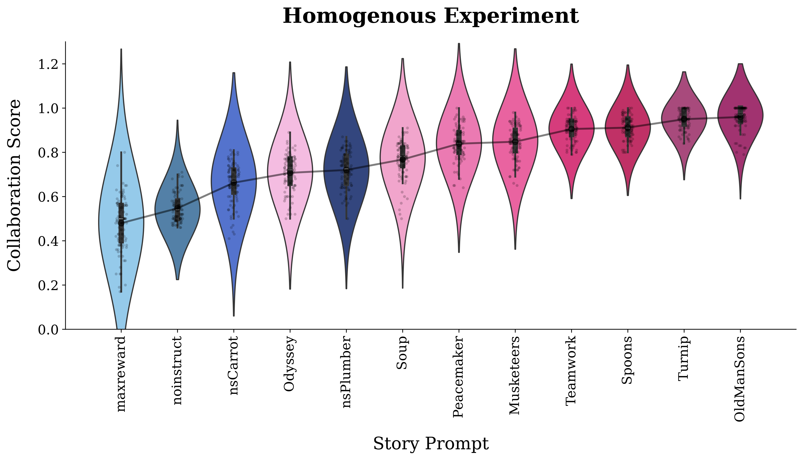
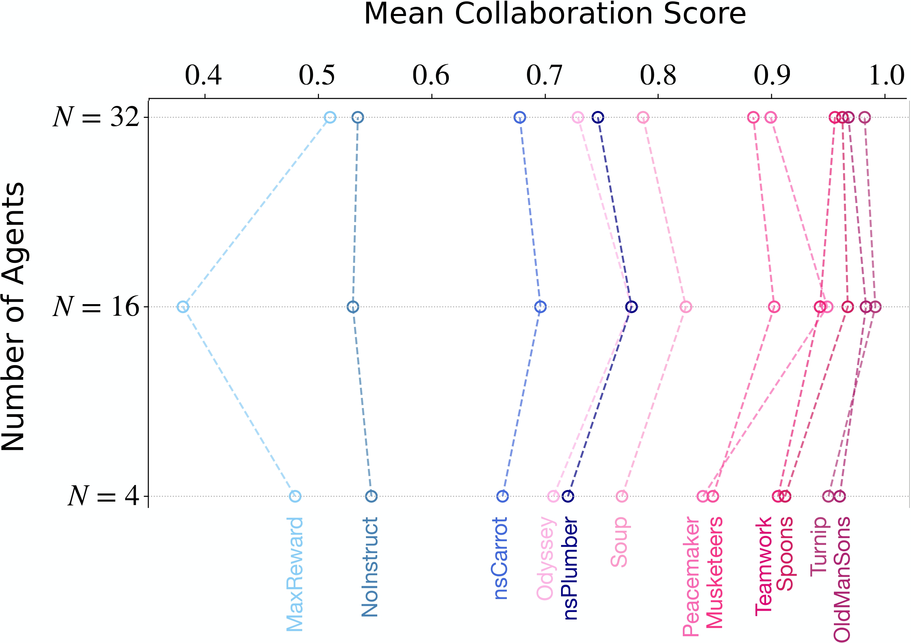
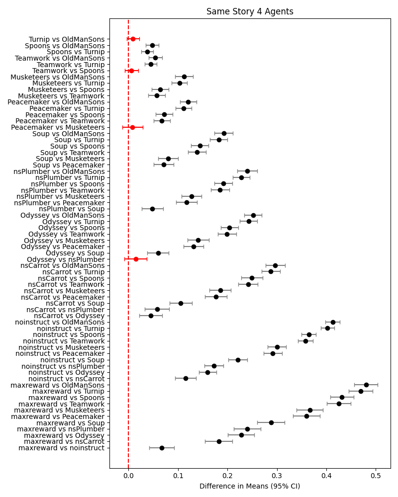

# **Story Agents - A Multi-Agent Public Goods Experiment**
[](https://colab.research.google.com/github/storyagents25/story-agents/)

## Releases

**v1.0-initial-experiments**  
Marks the commit corresponding to the initial experiments as described in the paper submitted for review.  
[🔗 View Tag on GitHub](https://github.com/storyagents25/story-agents/tree/v1.0-initial-experiments)

**v1.1-arxiv-upload**  
Marks the commit corresponding to the rerun Heterogeneous experiment (temp = 0.6, 400 games).  
[🔗 View Tag on GitHub](https://github.com/storyagents25/story-agents/tree/v1.1-arxiv-upload)

## **Overview**
**Story Agents** is a multi-agent framework for studying how different storytelling influences cooperation in a repeated **Public Goods Game**. The framework allows experiments where **agents contribute tokens**, earn payoffs, and analyze the effects of different story assignments.

This project consists of **two main experiments**:
1. **Homogenous Experiment**: 

    - **Cooperation Among Homogeneous Agents:**
4 agents are prompted with the same story from a set of 12 stories and play 100 games.

    - **Scaling Experiment:**
We investigate scaling behavior by increasing the number of agents, N ,
from 4 to 16 and 32. 

    - **Robustness Experiment**: 
To assess cooperative resilience under adversarial conditions, we designed a robustness experiment with 4 agent groups in which one agent consistently contributed **zero tokens (dummy agent)**, simulating persistent free-riding behavior.

2. **Heterogenous Experiment**: 4 playing agents are each prompted by a random story from a set of 12 stories and play 400 games.

### **Illustration**

Repeated multi-round public goods game among homogeneous and heterogeneous LLM agents primed with various narratives.
<p align="center">  </p>

The study tracks the following metrics:
- **Contributions** per round
- **Round Payoffs**
- **Cumulative Payoffs**
- **Collaboration Score**

---
## **Features**
- Multi-agent framework with LLM-powered decision-making  
- Customizable storytelling influence on cooperation  
- Three experiment types to evaluate different scenarios  
- Automatic logging of results and intermediate saving for resuming experiments  
- Supports different model configurations (LLMs, rule-based, and dummy agents)   

---

## **Installation**
### **1. Clone the Repository**
```bash
git clone https://github.com/storyagents25/story-agents
```
```bash
cd story-agents
```
## **2. Installation Dependencies**
You can set up the project using **Conda** or **Pip**.

### **Option 1: Using Conda**
Install dependencies using the provided **Conda environment file**:
```bash
conda env create -f environment.yml
```
```bash
conda activate story-agents
```
### **Option 2: Using Google Colab**
You can upload the  `story_agents_experiments.ipynb` file to [Google Colab](https://colab.research.google.com/?utm_source=scs-index) or click on the _open in colab_ badge at the top.

### **Option 3: Using Pip**
```bash
pip install -U langchain-community
```
```bash
pip install --upgrade langchain_openai -q
```
```bash
pip install numpy pandas matplotlib seaborn jupyterlab nbformat ipykernel
```

## **Setup API Keys**
### **For OpenAI Models**
export OPENAI_API_KEY="your-api-key"
### **For LLAMA Model**
export LLAMA_API_URL="your-hosted-url"

## **Usage**
### **Running the Experiments**
You can run different experiments using the `main.py` script.

---

### **1. Homogenous Experiment**
Runs **100 games per story** for agent sizes **[4, 16, 32]**.

#### **(a) Cooperation Among Homogeneous Agents**
To run across the experiment for all stories:
```bash
for i in {0..11}; do python main.py --exp_type same_story --story_index $i; done
```
#### **(b) Robustness Experiment**
Same as the same story experiment, but introduces one dummy agent who always contributes 0. <br>

To run across the experiment for all stories:
```bash
for i in {0..11}; do python main.py --exp_type bad_apple --story_index $i; done
```
### **2. Heterogenous Experiment**
Assigns a random story to each agent and runs 200 games with 4 agents.
```bash
python main.py --exp_type different_story
```

## **Visualization**
The project includes scripts to visualize collaboration and scaling results.
### **1. Distribution Analysis Plots**
Generates violin plots for different experiment types:

- Collaboration Score for Homogenous and Robustness experiments.
- Payoff per Agent for Heterogenous experiment.

Run:
```bash
python visualise_collaboration.py
```
Example Output:
<p align="center">  </p>

### **2. Scaling Experiment Visualization**
Plots the mean collaboration score across agent sizes to analyze scaling effects in Homogenous Experiment

Run:
```bash
python visualise_scaling_experiment.py
```
Example Output:

<p align="center">  </p>

### **3. Bootstrapped Pairwise Differences Visualization**
Generates bootstrap-resampled distributions of pairwise differences in collaboration scores (and payoffs) between experiment conditions.

You can upload the  `pairwise_CI_analysis.ipynb` file to [Google Colab](https://colab.research.google.com/?utm_source=scs-index) or click on the _open in colab_ badge at the top.

Example Output: 

<p align="center">  </p>

### **4. Summary Statistics Table**
Generates a LaTeX table of mean ± standard deviation for final Collaboration Scores (homogeneous & robustness conditions) and final Cumulative Payoffs (heterogeneous conditions) across all story prompts with adaptive decimal precision.

Run:
```bash
python vis_appendix_table.py
```