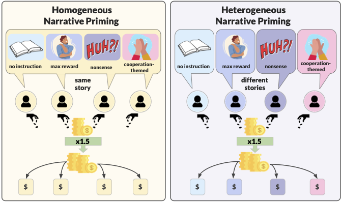
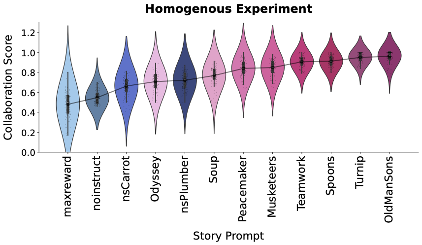
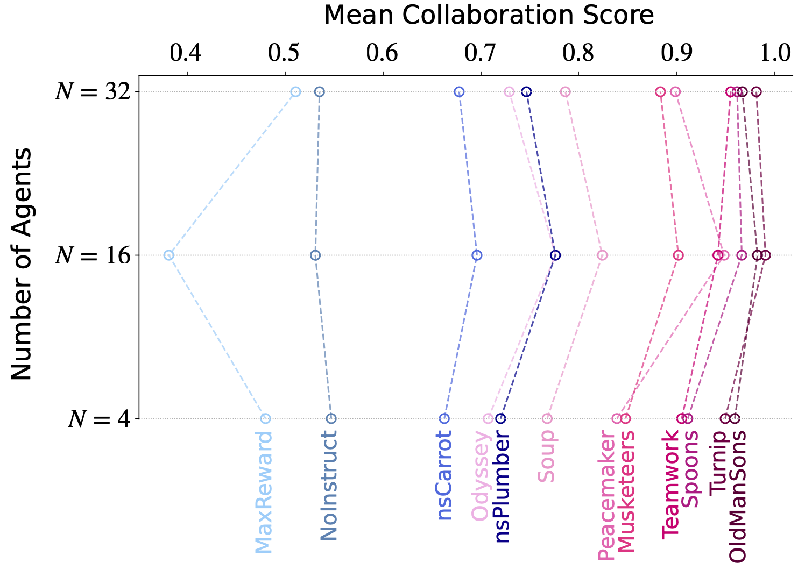
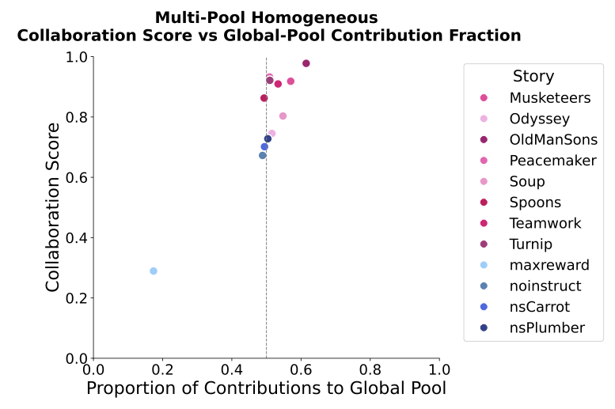

# **Story Agents - A Multi-Agent Public Goods Experiment**
A comprehensive framework for running multi-agent public goods game experiments with narrative priming, supporting single-pool and multi-pool network topologies. 

[](https://colab.research.google.com/github/storyagents25/story-agents/)

## Releases

**v1.0-initial-experiments**  
Marks the commit corresponding to the initial experiments as described in the paper submitted for review.  
[🔗 View Tag on GitHub](https://github.com/storyagents25/story-agents/tree/v1.0-initial-experiments)

**v1.1-arxiv-upload**  
Marks the commit corresponding to the rerun Heterogeneous experiment (temp = 0.6, 400 games).  
[🔗 View Tag on GitHub](https://github.com/storyagents25/story-agents/tree/v1.1-arxiv-upload)

**v1.2-unified-single-multi-pool**  
Marks the commit corresponding to the single/multi-pool experiments.   
[🔗 View Tag on GitHub](https://github.com/storyagents25/story-agents/tree/v1.2-unified-single-multi-pool)

## **Overview**
**Public goods games** are fundamental models for understanding cooperation in economics, psychology, and social science. Players face a social dilemma: contribute to a shared pool (benefiting everyone) or keep tokens for themselves (individual benefit). **Story Agents** investigates a novel question: *How do different narratives shape cooperative behavior in these strategic interactions?*
 
Our framework enables **LLM-powered agents** to participate in **repeated networked public goods games** while being primed with different stories—from folk tales about teamwork to narratives emphasizing individual success. We examine how narrative priming affects agent strategic decision-making.

Unlike traditional single-pool public goods experiments, our framework supports both **simple** and more **complex network structures**: 
1. **Single-Pool**: traditional public goods game setup with one shared global pool (shared by all agents), simple contribution decision per round 
2. **Multi-Pool**: more complex network topology with global (all agents) + local pools (agent subsets), agents balance contributions across multiple groups, sequential contribution decisions across pools 

Our framework systematically tests cooperation across three key dimensions:
1. **Homogenous Experiment**: 
    - All agents receive the same story prompt from 12 different narratives  
    - Tests how specific stories affect group cooperation 
    - Supports scaling across agent sizes (4 → 16 → 32 agents)

2. **Robustness Experiment**: 
    - Same as homogeneous but includes one persistent free-rider (aka dummy agent, always contributes 0) 
    - Tests cooperation resilience under persistent free-riding 

3. **Heterogenous Experiment**: 
    - Each agent receives a random story from the corpus 
    - Reveals cooperation dynamics when agents have different narrative influences 

### **Illustration**

Repeated public goods game with narrative priming. *Homogeneous*: all agents receive identical story prompts. *Heterogeneous*: each agent receives different narrative priming, creating mixed behavioral contexts within the same game. 
<p align="center">  </p>

The study tracks the following metrics:
- **Contributions** per round
- **Round Payoffs**
- **Cumulative Payoffs**
- **Collaboration Score**
- **Pool Allocation Patterns**
---
## **Features**
- Dual pool topologies: single-pool (traditional) and multi-pool (networked) game configurations 
- Multi-agent cooperation with LLM-powered decision-making 
- Customizable storytelling influence on cooperation patterns 
- Three experiment types for comprehensive evaluation 
- Checkpoint/Resume: automatic experiment state saving and resumption 
- Comprehensive visualizations

---

## **Installation**
### **1. Clone the Repository**
```bash
git clone https://github.com/storyagents25/story-agents
```
```bash
cd story-agents
```
## **2. Installation Dependencies**
You can set up the project using **Conda** or **Pip**.

### **Option 1: Using Conda**
Install dependencies using the provided **Conda environment file**:
```bash
conda env create -f environment.yml
```
```bash
conda activate story-agents
```
### **Option 2: Using Google Colab**
You can upload the  `story_agents_experiments.ipynb` file to [Google Colab](https://colab.research.google.com/?utm_source=scs-index) or click on the _open in colab_ badge at the top.

### **Option 3: Using Pip**
```bash
pip install -U langchain-community
```
```bash
pip install --upgrade langchain_openai -q
```
```bash
pip install numpy pandas matplotlib seaborn jupyterlab nbformat ipykernel networkx imageio pillow scipy requests
```

## **Setup API Keys**
### **For OpenAI Models**
export OPENAI_API_KEY="your-api-key"
### **For LLAMA Model**
export LLAMA_API_URL="your-hosted-url"

export LLAMA_API_KEY="your-api-key" 

## **Usage**
### **Running the Experiments**
The framework uses `main.py` with –pool_type parameter to control pool topology. 

---

### **1. Homogenous Experiment**
**Single-Pool:**
    
#### (a) Run specific story (pool_type=single is default, can be omitted)
```bash
python main.py --exp_type same_story --story_index 0
```

#### (b) Or explicitly specify single-pool
```bash
python main.py --exp_type same_story --story_index 0 --pool_type single
```
#### (c) Run all 12 stories (portable shell syntax)
```bash
for i in $(seq 0 11); do 
    python main.py --exp_type same_story --story_index $i 
done
```

**Multi-Pool:**

#### (a) Run specific story with multi-pool topology (pool_sizes defaults to [2])
```bash
python main.py --exp_type same_story --story_index 0 --pool_type multi
```

#### (b) Explicitly specify pool sizes (optional)
```bash
python main.py --exp_type same_story --story_index 0 --pool_type multi --pool_sizes 2
```
#### (c) Run all 12 stories with multi-pool topology
```bash
for i in $(seq 0 11); do 
    python main.py --exp_type same_story --story_index $i --pool_type multi
done
```

### **2. Robustness Experiment**
**Single-Pool:**
    
#### (a) Test resilience with dummy agent
```bash
python main.py --exp_type bad_apple --story_index 0
```

#### (b) Run all stories for robustness testing

```bash
for i in $(seq 0 11); do 
    python main.py --exp_type bad_apple --story_index $i 
done
```

**Multi-Pool:**

#### (a) Test resilience in networked setting
```bash
python main.py --exp_type bad_apple --story_index 0 --pool_type multi
```

#### (b) Run all stories with multi-pool robustness testing
```bash
for i in $(seq 0 11); do 
    python main.py --exp_type bad_apple --story_index $i --pool_type multi
done
```
### **3. Heterogenous Experiment**
**Single-Pool:**
```bash
python main.py --exp_type different_story
```
Or explicitly:
```bash
python main.py --exp_type different_story --pool_type single
```
**Multi-Pool:**

```bash
python main.py --exp_type different_story --pool_type multi

```


## **Visualization Outputs**

The project includes scripts to visualize collaboration and scaling results.
### **1. Single-Pool Visualizations**

- **Violin Plots**: distribution of collaboration scores by story
- **Scaling Analysis**: performance across agent sizes (4→16→32)
- **Summary Table**: LaTeX-formatted statistics table
### **2. Multi-Pool Visualizations**
- **Collaboration Violin Plots**: score distributions by story  
- **Strategy Scatter Plots**: global vs local pool allocation patterns  
- **Payoff Analysis**: individual agent performance by story

### Generate all plots
Run:
```bash
python visualize_results.py --generate_all
```
### Generate specific experiment type
Run: 
```bash
python visualize_results.py --exp_type single_pool
```
```bash
python visualize_results.py --exp_type multi_pool
```
Example Output:

Collaboration scores for homogeneous group (\(N=4\)).
<p align="center">  </p>

Scaling experiment results for homogeneous agents across different group sizes \[N={4,16,32}\].

<p align="center">  </p>

Story-level collaboration scores vs. Global pool allocation fractions

<p align="center">  </p>
